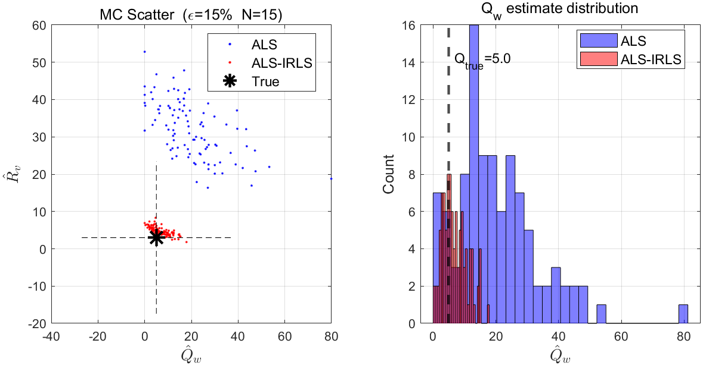
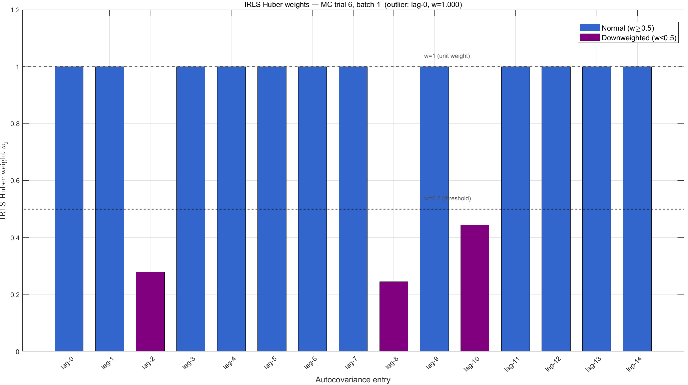

# ALS-IRLS: Outlier-Robust Autocovariance Least-Squares Estimation

This repository provides the official MATLAB implementation of the **ALS-IRLS** algorithm, as proposed in the paper:

> **"Outlier-Robust Autocovariance Least-Squares Estimation via Iteratively Reweighted Least Squares"**  
> *Jiahong Li, Fang Deng*  

## 📌 Overview

The Autocovariance Least-Squares (ALS) method is a powerful tool for estimating the unknown process and measurement noise covariance matrices ($Q$ and $R$) for Kalman filters. However, the standard ALS relies on the least mean squares (LMS) criterion, making it highly vulnerable to non-Gaussian measurement outliers. A single severe outlier can completely corrupt the empirical innovation autocovariances, causing the standard ALS to yield grossly inaccurate covariance estimates.

**ALS-IRLS** solves this critical vulnerability by:
1. Recasting the ALS regression as an **outlier-robust regression problem** using the Huber cost function.
2. Employing the **Iteratively Reweighted Least Squares (IRLS)** technique to dynamically down-weight the outlier-corrupted autocovariance entries.
3. Incorporating **closed-form Positive Semi-Definite (PSD) cone projections** to ensure physically admissible covariance estimates.

Our extensive simulations demonstrate that ALS-IRLS reduces the covariance estimation RMSE by **over two orders of magnitude** compared to standard ALS, allowing downstream state estimation to approach the Oracle lower bound even under severe $\epsilon$-contamination.

## 📈 Experimental Results

The following figures demonstrate the superiority of the proposed ALS-IRLS method under severe measurement outlier contamination ($\epsilon = 15\%$, magnitude multiplier $\omega = 8$).

### 1. Covariance Estimation Accuracy

  

*Figure 1: Monte Carlo scatter of estimated $(Q, R)$ over 100 trials. The standard ALS estimates (blue) are severely biased due to outliers, clustering far from the true values. In contrast, the proposed ALS-IRLS estimates (red) tightly concentrate around the true covariance values (black star).*

### 2. State Estimation Performance (End-to-End)

  

*Figure 2: Mean state estimation RMSE across 5 baselines. While filter-level robust methods (Student's-t KF and MCKF) suffer when initial covariances are misspecified, KF+ALS-IRLS successfully identifies the true statistics online, achieving state RMSE within 9% of the Oracle lower bound.*

## 🚀 Repository Structure

The codebase is organized into a modular MATLAB framework.

### 1. Main Execution Script
- `als_irls_main.m`
  - The main script to run the comprehensive Monte Carlo simulation.
  - It sequentially runs the **Oracle KF**, **KF+ALS (Standard)**, **KF+ALS-IRLS (Ours)**, **Student's-t KF**, and **Maximum Correntropy KF (MCKF)**.
  - Generates the comparative RMSE results and visual scatter plots.

### 2. Core Algorithm (Our Contribution)
- `irls_huber.m`
  - Implements **Algorithm 1**: The IRLS solver for Huber-loss robust regression.
- `build_ALS_matrix.m`
  - Constructs the ALS design matrix $\mathcal{A}$ based on the system dynamics and current Kalman gain.
- `compute_b_LS.m`
  - Computes the empirical innovation autocovariance vector $b$.
- `symtran.m`
  - Utility function for matrix symmetrization and Positive Semi-Definite (PSD) projection via eigen-decomposition (Remark 3 in the paper).

### 3. Baseline Robust Filters
- `student_t_kf.m`
  - Implementation of the Student's-t Robust Kalman Filter.
- `mckf.m`
  - Implementation of the Maximum Correntropy Kalman Filter (MCKF).
- `run_kf.m`
  - Standard Kalman Filter routine used by Oracle, ALS, and ALS-IRLS.

📧 Contact
For any questions or discussions regarding the algorithm, please feel free to open an issue or contact:

Jiahong Li (jqr_jiahong@buu.edu.cn)

Fang Deng (dengfang@bit.edu.cn)